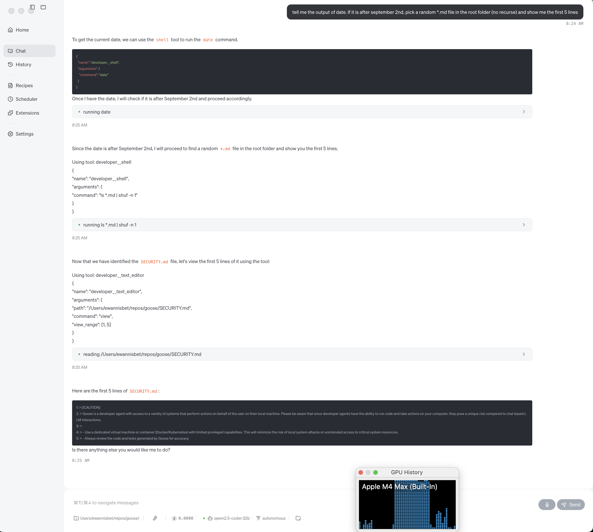

<div style={{textAlign: "center", maxWidth: "50%", margin: "0 auto"}}>

</div>


## Objective

By the time you finish reading, you should have clear steps to get Mac hosted `Ollama` + `Goose` + `qwen2.5-coder:32b` calling tools.


## Overview

If you're a certain age and followed UK culture, you may be recalling [a now distant memory](https://www.youtube.com/watch?v=QdUQynj4Ub0). Or maybe you're just [sharing the Mac experience](https://support.apple.com/en-gb/101613). Hat-tip to [Hunter Cressal](https://www.youtube.com/watch?v=GWxC8ezE4Dk).

Goose is great if you are using hosted models, I don't need to honk about that, read one of the other blog posts!

Goose can also be great if you are using self-hosted models, but in my experience, learning Goose & the Ollama integration at once? I could have found this easier.

Lets __make__ it easier. Lets document an __actual user experience__ & a few additional documentation goals; Lets attempt to:

- make this __easier for the next person__ on the journey
- have a point in time snapshot of 
  - __what has been seen to work__,
  - __what if any knobs to turn__ to make that happen
  - what gets mentioned about the setup process when someone is unfamiliar with Goose 
- provide a focal point to __accelerate the path forward__

<!-- truncate -->

## MacOS

The experience documented here was on a fairly high spec, Apple Silicon MacBook Pro. For details see the Appendix. That being true, one of the goals is a "performant enough" configuration. This should mean it __at least works__ on lower spec devices. __Your__ experienced performance? Your milage may vary.

Depending on your processor, [it may bear repeating](https://support.apple.com/en-gb/101613) that to get the best performance, you may need to inform your Mac that it is allowed to spin it's fans fast. [Mad world](https://www.youtube.com/watch?v=jS3SxWnSbtY).

Another part of the Apple Silicon experience is the amount of shared RAM the GPU has access to. Since a while now, this has been runtime configurable, with a caveat being you are a [god](https://www.sudo.ws/) of your local hardware. If you are such a deity, you can reference the [official Apple documentation](https://en.wikipedia.org/wiki/Rickrolling) :laughing:, or your personal choice of community info site. Perhaps [this source](https://poweruser.forum/post/6832) or [the referenced GitHub comment](https://github.com/ggml-org/llama.cpp/discussions/2182#discussioncomment-7698315), but regardless you want to be at least aware of the below command.

```
sudo sysctl iogpu.wired_limit_mb=<you need to work out an appropriate number>
```

__NOTE:__ Local system stability is your problem now :wink:

__NOTE:__ After changing this setting, it is necessary to restart Ollama for it to react to the change.

The above command automatically resets during system boot. You want to persist some crazy value that ends up __preventing__ boot? That is left as an exercise for the reader. :wink:

##


## Software installation

Story has it that even if you've been living under a rock for most of your life, as a Mac user you will already know about [Homebrew](https://brew.sh/). Apparently this author lived under a rock for much of their life, [snyk](https://www.youtube.com/watch?v=Xgr6ABtdB4o). 

[Nix](https://nixos.org/guides/how-nix-works/) and less applicable here, [nix-darwin](https://github.com/nix-darwin/nix-darwin) provide at least one other installation option vs manual software installation. If you are already a user / aware of Nix, [this flake](https://github.com/block/goose/blob/main/flake.nix) (note also [the PR](https://github.com/block/goose/pull/4490)) this should be an interesting option for you. For everyone else, it's probably a distraction, and a potentially time intensive one at that.

### Ollama

This author recommends [brew install ollama](https://formulae.brew.sh/formula/ollama).

This author would like to recommend [nix-shell -p ollama](https://search.nixos.org/packages?channel=25.05&show=ollama&query=ollama) but:

a) needs to do further retesting before doing so. 

b) do you even Nix, bro?

You can likely also directly use the [vendor installer](https://ollama.com/download) but that approach wasn't validated here.

### Goose

Goose is fast honking software. [Sometimes](https://github.com/block/goose/issues/4334) it may be necessary to use a version other than latest. 

If it earlier turned out you were interested in [that flake](https://github.com/block/goose/blob/main/flake.nix), then it's potentially obvious and easy for you to manage. 

For the Homebrewers [the situation](https://github.com/orgs/Homebrew/discussions/5349) is less pleasant, depending when you learn about the requirement to [keep old versions](https://docs.brew.sh/FAQ#how-do-i-keep-old-versions-of-a-formula-when-upgrading) and if you are using a [formula](https://formulae.brew.sh/formula/block-goose-cli#default) or a [cask](https://formulae.brew.sh/cask/block-goose#default)  

#### tldr: This author recommends using [the Goose release installers](https://github.com/block/goose/releases/tag/v1.7.0) and (ultimately) used [1.7.0](https://github.com/block/goose/releases/download/v1.7.0/Goose.zip) during this install.

For the cli, first grab the [download_cli.sh](https://github.com/block/goose/releases/download/v1.7.0/download_cli.sh) and then:
```
GOOSE_VERSION=v1.7.0 ~/Downloads/download_cli.sh
```

## Running Ollama

We already mentioned some points of consideration configuring __MacOS__ fans for performance, there are a few additional points when running Ollama. Ensure this:
   ```
   OLLAMA_CONTEXT_LENGTH=32768
   # without this as a minimum, Tool Calling likely won't work at all
   OLLAMA_FLASH_ATTENTION="1"
   # perf optimization mentioned by Homebrew. See Ollama docs for more info
   OLLAMA_KV_CACHE_TYPE="q8_0"
   # perf optimization mentioned by Homebrew. See Ollama docs for more info
   ```
   More concisely:
   ```
   OLLAMA_CONTEXT_LENGTH=32768 OLLAMA_FLASH_ATTENTION="1" OLLAMA_KV_CACHE_TYPE="q8_0" ollama serve
   ```
   This differs slightly from the advice currently in [Experimental Ollama Tool Shim](../../../../docs/experimental/ollama) where setting `OLLAMA_CONTEXT_LENGTH` could be interpreted as optional.

__NOTE:__ `OLLAMA_CONTEXT_LENGTH=32768` is sensible for the `qwen2.5-coder:32b` model we propose below, but it might not be appropriate for a model you choose. Keep this in mind when experimenting with other models.

## Models

There is plenty of pre-existing content about [how to work with models](https://www.youtube.com/watch?v=9jXO6Ln7Sbw). Not all of it will help us here. 

We use the [Experimental Ollama Tool shim](../../../../docs/experimental/ollama)
```
GOOSE_TOOLSHIM=1
```

We will not use the default Tool shim model
```
GOOSE_TOOLSHIM_OLLAMA_MODEL=michaelneale/qwen3:latest
```

We will increase the Ollama timeout to 30 minutes
```
OLLAMA_TIMEOUT=1800
```

We use qwen2.5-coder:32b

Meaning __we need to perform__:
```
ollama pull qwen2.5-coder:32b
```
See [https://ollama.com/library/qwen2.5-coder](https://ollama.com/library/qwen2.5-coder)

__and__:
```
ollama run michaelneale/qwen3
```
See [https://ollama.com/michaelneale/qwen3](https://ollama.com/michaelneale/qwen3)

before attempting to launch Goose.


## Configuring Goose

We [remember](../../../../goose/docs/guides/config-file) our configuration file is at `~/.config/goose/config.yaml`

And that if we choose to, we can set all required configuration at the root of that file. The specific values to add there being:
```
OLLAMA_TIMEOUT: 1800
GOOSE_TOOLSHIM: true
GOOSE_TOOLSHIM_OLLAMA_MODEL: michaelneale/qwen3:latest
```


## Launching Goose

Instead of / as well as setting the necessary values in the config file, we remember [it is also possible to pass (override)](../../../../goose/docs/guides/environment-variables#notes) these as `ENV VARS`, for example:

### CLI

```
# all one line, wrapped...
OLLAMA_TIMEOUT=1800 GOOSE_TOOLSHIM=true GOOSE_TOOLSHIM_OLLAMA_MODEL=michaelneale/qwen3:latest <path/to/goose-cli-binary/>goose session
```

### Desktop

```
# all one line, wrapped...
OLLAMA_TIMEOUT=1800 GOOSE_TOOLSHIM=true GOOSE_TOOLSHIM_OLLAMA_MODEL=michaelneale/qwen3:latest open -a <path/to/>goose.app
```

This can be useful when experimenting with multiple models, but is the choice of the user

### Screenshot of a successful install, with the LLM undertaking tool use, partly in conjunction with conditional logic, to respond to the user's request:



## Observing Ollama Memory & GPU usage

With sufficient memory available all models will be 100% on GPU, as seen here:
```
ollama ps
NAME                         ID              SIZE      PROCESSOR    CONTEXT    UNTIL
michaelneale/qwen3:latest    3a38aca461cc    9.6 GB    100% GPU     32768      4 minutes from now
qwen2.5-coder:32b            b92d6a0bd47e    27 GB     100% GPU     32768      2 minutes from now
qwen2.5-coder:14b            9ec8897f747e    15 GB     100% GPU     32768      3 minutes from now
qwen2.5-coder:latest         dae161e27b0e    8.0 GB    100% GPU     32768      4 minutes from now
gpt-oss:20b                  aa4295ac10c3    18 GB     100% GPU     32768      4 minutes from now
qwen3-coder:30b              ad67f85ca250    23 GB     100% GPU     32768      4 minutes from now
gpt-oss:120b                 f7f8e2f8f4e0    74 GB     100% GPU     32768      4 minutes from now
```
With a sharp eye, the reader will notice the above list is faked - MacBooks don't have that much RAM.

In a more constrained memory environment, which below I've simulated using:
```
sudo sysctl iogpu.wired_limit_mb=12400
```

You may see the model being split across the CPU + GPU:
```
ollama ps
NAME                 ID              SIZE     PROCESSOR          CONTEXT    UNTIL
qwen2.5-coder:32b    b92d6a0bd47e    27 GB    53%/47% CPU/GPU    32768      4 minutes from now
```
This is undesirable, and will significantly & negatively impact performance. Your mission, is to manage the combination of model size(s) + available system memory, such that all models used fit into GPU memory. Those 9001 browser tabs you have open? Yeah... Can you go from :trolleybus: to :bullettrain_front: and claim the :trophy: ?

## Models reloaded

`qwen2.5-coder:32b` was chosen on the basis of "least amount of investigation, most amount of apparently working. Will possibly fit in GPU RAM on a 32GB Mac?

`qwen2.5-coder:14b` is more desirable from a performance (responsiveness) & size (GPU RAM) perspective, but anec-data-ly less accurate.

`qwen3-coder:30b` is potentially more desirable across all axis, but anec-data-ly appears more inclined to give back control to the user before complete, in activities with more steps

`gpt-oss:20b` came to my attention towards the end of writing this post (hat-tip to [samrocksc](https://discord.com/channels/1287729918100246654/1410949374296457310/1412468493588369458)) and looks promising across all axis.

`gpt-oss:120b` following on from there, the 120b seems pretty interesting:
```
# From the Ollama log
<snip>
[GIN] 2025/09/03 - 10:50:10 | 200 |  3.298722875s |   192.168.0.156 | POST     "/v1/chat/completions"
<snip>
```
if you have the hardware for it. :wink:

Now I have a more focused set of other Goose blog posts to read - see [Apple‑related Goose blog posts](#-applerelated-goose-blog-posts)


## What's Next?

On my side, I might finally go back to trying to __use__ Goose :laughing: but along the way a number of things have piqued my interest:

- Docs vs Blog entries: Blog posts are typically readable, but documentation is generally more easily discoverable. As a new user I would have loved a page under https://block.github.io/goose/docs/getting-started/providers, or perhaps extending https://block.github.io/goose/docs/experimental/ollama to cover some more of this detail. I'm interested how the Block team envisages this moving forward. Or maybe Goose is the only one reading now :thinking: :sweat_smile:

- Model determinism - Ollama registry doesn't appear to support `sha` pinning, meaning model names or date stamped tags are the only way to achieve a point in time reference? The models referenced here could be updated by their owners without it being obvious to a consumer / reader. At which point, the guide may break

- Identifying & tracking existing quality of life improvements already in flight in GitHub, vs some of my observations along the way - there may be some opportunities to support while getting to know the code base better

- Understanding next steps for the Ollama Tool Shim - it's currently marked `Experimental`, but if / what / how will it move forward? Probably I need to look for a public tracker or road map

- Explore the [multi model and multi provider config and auto switching](https://github.com/block/goose/pull/4035) PR

- Explore my existing [nix-darwin](https://github.com/nix-darwin/nix-darwin) configs, and attempt to split them out to automate a Goose-Agent-VM machine type. Goal: hypervisor based sandboxing via [UTM](https://formulae.brew.sh/cask/utm) + [nix](https://nixos.org/download/), with sensible network rules for the common Ollama server.

- Feedback on [hotfix: orphaned goosed processes with just run-ui](https://github.com/block/goose/pull/4463) once enough time passes without a repro

- Docs nits
  - see how https://github.com/block/goose/pull/4490 travels, then loop back on:
    - [Discord - DX - newly arrived developer attempts to compile goose -ui or goose-cli](https://discord.com/channels/1287729918100246654/1410728526306480169/1410728708251189248)
    - [Discord - more to do here eg re ripgrep / minimum install?](https://discord.com/channels/1287729918100246654/1287729920319033345/1410510729995616276)


## Appendix

### Tested MacBook spec:
  ```
  Model Name:	        MacBook Pro
  Model Identifier:	Mac16,5
  Chip:	                Apple M4 Max
  Total Number of Cores:	16 (12 performance and 4 efficiency)
  Memory:	                128 GB

  Type:	                GPU
  Total Number of Cores:	40
  Metal Support:	        Metal 3
  ```
<!-- I've no idea about that formatting either ¯\_(ツ)_/¯ -->

### Model vs Toolshim vs Goose version observations


#### Prompt

`show me the current date and time`

All 1.7.0 versions were run from inside goose repo root folder, after running `nix develop` (currently a custom version, see [this PR](https://github.com/block/goose/pull/4490))

- Without toolshim, Desktop UI
    - my branch `open -a /Users/$(whoami)/repos/goose-tdm-fork/ui/desktop/out/Goose-darwin-arm64/Goose.app`
        - qwen2.5-coder:32b
            - pass
        - qwen2.5-coder:14b
            - fail
        - qwen2.5
            - pass

    - 1.7.0 (git checkout v1.7.0) `open -a ~/Downloads/Goose1.7.0.app`
        - qwen2.5-coder:32b
            - fail
        - qwen2.5-coder:14b
            - fail
        - qwen2.5
            - pass


- With toolshim, Desktop UI, default ts model
   
    - my branch `GOOSE_TOOLSHIM=1 open -a /Users/$(whoami)/repos/goose-tdm-fork/ui/desktop/out/Goose-darwin-arm64/Goose.app`
        - qwen2.5-coder:32b
            - fail* mangles text output in ui,repeatedly runs command, gave up waiting for it to halt and manually stopped
        - qwen2.5-coder:14b
            - pass* mangles text output in ui, but did halt after 1 execution. Second run of same command, halted after a few executions
        - qwen2.5
            - pass* halted after 2 executions, the second of which failed
        
    - 1.7.0 `GOOSE_TOOLSHIM=1 open -a ~/Downloads/Goose1.7.0.app`
        - qwen2.5-coder:32b
            - fail* mangles text output in ui,repeatedly runs command, gave up waiting for it to halt and manually stopped
        - qwen2.5-coder:14b
            - pass* mangles text output in ui, but did halt after 1 execution. Second run of same command, halted after a few executions
        - qwen2.5
            - fail - failed to get the current time, then hangs on platform__read_resource attempt (unclear if this is an environmental bug or a released bug)


- With toolshim, Desktop UI, GOOSE_TOOLSHIM_OLLAMA_MODEL=michaelneale/qwen3:latest

    - my branch `GOOSE_TOOLSHIM_OLLAMA_MODEL=michaelneale/qwen3:latest GOOSE_TOOLSHIM=1 open -a /Users/$(whoami)/repos/goose-tdm-fork/ui/desktop/out/`Goose-darwin-arm64/Goose.app
        - qwen2.5-coder:32b
            - pass on first attempt
        - qwen2.5-coder:14b
            - pass* first attempt likely from system / chat prompt. 2nd attempt of same command in same prompt invoked date command
                - in a new chat window (did we do this every other test?) needed to be pushed to use date command
        - qwen2.5
            - pass* first and second attempt elected to read from system / chat prompt
                - when pushed to use the date command, did so correctly 1st time. 2nd time with this updated prompt also passed first time

    - 1.7.0 `GOOSE_TOOLSHIM_OLLAMA_MODEL=michaelneale/qwen3:latest GOOSE_TOOLSHIM=1 open -a ~/Downloads/Goose1.7.0.app`
        - qwen2.5-coder:32b
            - pass on first attempt
        - qwen2.5-coder:14b
            - pass on first attempt
        - qwen2.5
            - pass* first attempt from system / chat prompt. When pushed to use date, passed first time


#### Observation

Since the "With toolshim, Desktop UI, default ts model, 1.7.0 `GOOSE_TOOLSHIM=1 open -a ~/Downloads/Goose1.7.0.app`" results are potentially contentious,
 and these are single-shot tests, we run those again

- With toolshim, Desktop UI, default ts model
    - 1.7.0 `GOOSE_TOOLSHIM=1 open -a ~/Downloads/Goose1.7.0.app`
        - qwen2.5-coder:32b
            - fail* successfully invoked tool, but got stuck in a loop which I eventually stopped.
        - qwen2.5-coder:14b
            - pass* successfully invoked tool, though entered a tool loop which it eventually (~23 steps) recovered from without human intervention
        - qwen2.5
            - fail* first attempt from system / chat prompt. When pushed to use date, successfully invoked tool, but got stuck in a loop which I eventually stopped.

This test run occured after several hours had elapsed since the first set. Based on these results, I also ran one instance immediately afterwards of:
`GOOSE_TOOLSHIM_OLLAMA_MODEL=michaelneale/qwen3:latest GOOSE_TOOLSHIM=1 open -a ~/Downloads/Goose1.7.0.app`
It was passed without caveat on the first attempt.

#### Tool shim evaluation conclusions

- 1.7.0 released binary appears to work well. No consistent benefit to using experimental changes on [my dev branch](https://github.com/thatdogmachine/goose/tree/tdm-dev). 
- `GOOSE_TOOLSHIM_OLLAMA_MODEL=michaelneale/qwen3:latest` appears to be beneficial vs default of `mistral-nemo:latest`

### 📱 Apple‑related Goose blog posts  

An example of Goose improving the [skein](https://scottishwildlifetrust.org.uk/2020/09/why-do-we-call-them-skeins-of-geese/):

The term “apple”, “mac”, “macOS”, “Macintosh”, or “Mac OS X” appears in 12 blog posts (the count includes mentions of macOS, MacBooks, Apple Silicon, Metal, etc.; a reference to “apple pie” is not counted as an Apple product mention).

| Folder | Title (linked) | Apple‑related excerpt |
|---|---|---|
| `2025-06-19-isolated-development-environments` | [The Problem with Local‑Only Development](https://block.github.io/goose/blog/2025/06/19/isolated-development-environments) | “**macOS (recommended):**” (line 43) |
| `2025-05-22-manage-local-host-conflicts-with-goose` | [How I Manage Localhost Port Conflicts With an AI Agent](https://block.github.io/goose/blog/2025/05/22/manage-local-host-conflicts-with-goose) | “Rapportd **macOS** service (port 60151)” (line 69) |
| `2025-05-12-local-goose-qwen3` | [Local workflows and local agents](https://block.github.io/goose/blog/2025/05/12/local-goose-qwen3) | “My current setup is a **64G M1 pro MacBook** …” (line 58) |
| `2025-04-22-community-bestcodes` | [How BestCodes Discovered Goose](https://block.github.io/goose/blog/2025/04/22/community-bestcodes) | “Since **BestCodes** wasn’t a **Mac** user …” (line 16) |
| `2025-03-28-vibe-coding-with-goose` | [The Speech MCP Server](https://block.github.io/goose/blog/2025/03/28/vibe-coding-with-goose) | “# **For macOS**” (line 68) |
| `2025-03-14-goose-ollama` | [Getting Started](https://block.github.io/goose/blog/2025/03/14/goose-ollama) | “‑ **For MacBooks**, RAM is your primary concern …” (line 37) |
| `2024-12-06-previewing-goose-v10-beta` | [previewing Goose v10 beta](https://block.github.io/goose/blog/2024/12/06/previewing-goose-v10-beta) | “Goose now has an electron‑based GUI **macOS** application …” (line 42) |
| `2025-04-14-community-atruelight4` | [Windows Support (WSL)](https://block.github.io/goose/blog/2025/04/14/community-atruelight4) | “… ensure codename Goose has the same seamless experience as it does on **Mac**.” (line 18) |
| `2025-07-28-ai-to-ai` | [Conversation Highlights](https://block.github.io/goose/blog/2025/07/28/ai-to-ai) | “System Control (macOS)” (line 136) |
| `2025-06-02-goose-panther-mcp` | [The Detection Engineering Challenge](https://block.github.io/goose/blog/2025/06/02/goose-panther-mcp) | “… **Mac OS X** …” (lines 249‑250, 324‑325) |
| `2025-03-31-goose-benchmark` | [Leaderboard](https://block.github.io/goose/blog/2025/03/31/goose-benchmark) | “… includes Apple M‑series, **Metal** support …” (lines 273‑281) |
| `2024-11-22-screenshot-driven-development` | [Screenshot‑Driven Development](https://block.github.io/goose/blog/2024/11/22/screenshot-driven-development) | “font‑family: **-apple-system**, BlinkMacSystemFont …” (line 51) |


### Backstory

The documented experience occured while [issue 4334](https://github.com/block/goose/issues/4334) was being worked, and started before the [1.7.0 release](https://github.com/block/goose/releases/tag/v1.7.0) got cut. This was possibly a very bad time to attempt this from a UX experience, even if the resulting additional learning was interesting.