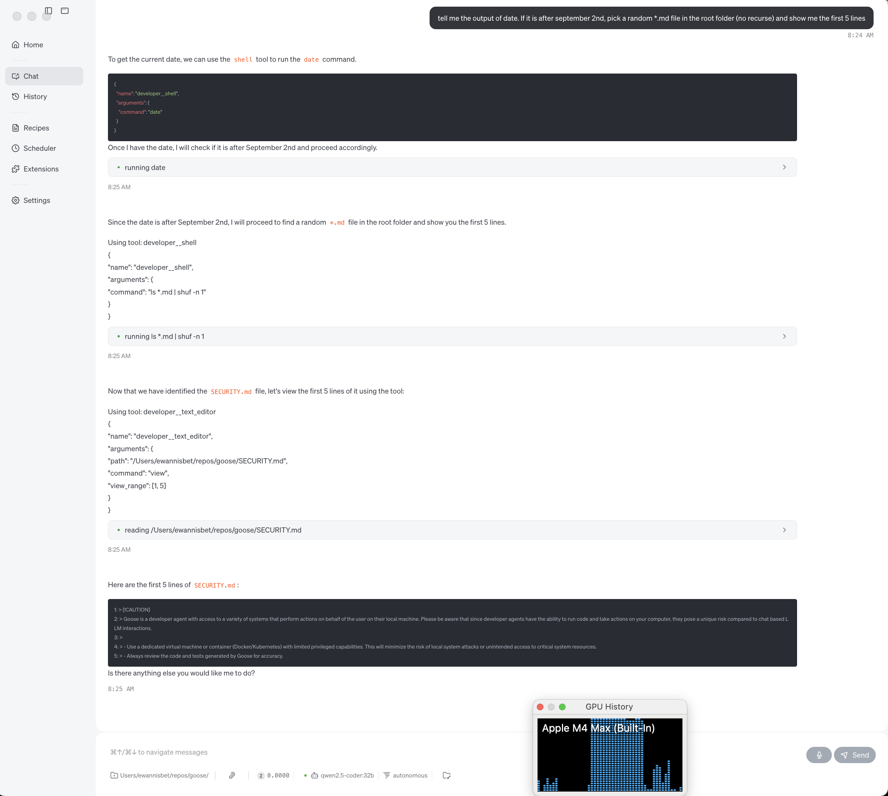

import Tabs from '@theme/Tabs';
import TabItem from '@theme/TabItem';
import { PanelLeft, Bot } from 'lucide-react';

## Installing Ollama

The original author recommends __[brew install ollama](https://formulae.brew.sh/formula/ollama)__.

The original author would like to recommend __[nix-shell -p ollama](https://search.nixos.org/packages?channel=25.05&show=ollama&query=ollama)__ but:

a) needs to do further retesting before doing so. 

b) is aware that not everyone uses, or wants to use, the package manager __[Nix](https://nixos.org/guides/how-nix-works/)__

You can likely also directly use the __[vendor installer](https://ollama.com/download)__, but that approach has not been validated with this guide.


## Running Ollama

In the __[Operating System Specifics - Mac](./mac.md)__ were mentioned some points regarding MacOS fans & performance, there are a few additional points when running Ollama. Ensure this:
   ```
   OLLAMA_CONTEXT_LENGTH=32768
   # without this as a minimum, Tool Calling likely won't work at all
   OLLAMA_FLASH_ATTENTION="1"
   # perf optimization mentioned by Homebrew. See Ollama docs for more info
   OLLAMA_KV_CACHE_TYPE="q8_0"
   # perf optimization mentioned by Homebrew. See Ollama docs for more info
   ```
   More concisely:
   ```
   OLLAMA_CONTEXT_LENGTH=32768 OLLAMA_FLASH_ATTENTION="1" OLLAMA_KV_CACHE_TYPE="q8_0" ollama serve
   ```
   This differs slightly from the advice currently in [Experimental Ollama Tool Shim](../../experimental/ollama) where setting `OLLAMA_CONTEXT_LENGTH` could be interpreted as optional.

__NOTE:__ `OLLAMA_CONTEXT_LENGTH=32768` is sensible for the `qwen2.5-coder:32b` model, but it might not be appropriate for a model you choose. Keep this in mind when experimenting with other models.

Having reached this point, return to __[Goose on Ollama - Start Here](../ollama-setup.md)__ and complete the remaining steps. Once complete, the screenshot below should be representative of your experience

### A successful install with the LLM undertaking tool use, conditional logic, in response to a user's request:

